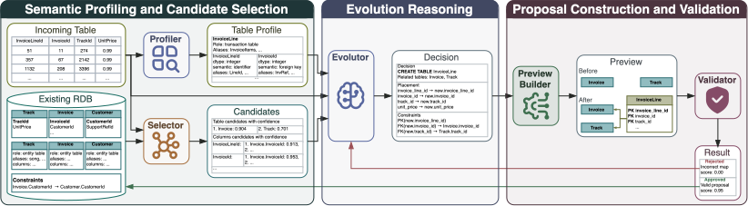

# CoRE

CoRE is a research framework for AI-assisted relational database maintenance.
Given an existing relational database and one incoming table, it predicts
whether to insert rows into an existing table, extend an existing table, or
create a new table, then produces and evaluates a structured integration
proposal.

This repository contains the implementation, baselines, benchmark cases, and
evaluation code used for the project. The benchmark data is intentionally kept
in the repository to support artifact review and reproducibility.

## Method overview

The standard pipeline uses the same case representation and output format as
the baselines:



Every case contains one existing RDB and exactly one incoming table. Outputs
include the final proposal, task trace, and database state after applying the
proposal.

## Installation

CoRE requires Python 3.11 or later. Create an isolated environment and install
the project from the repository root:

```bash
python -m venv .venv
source .venv/bin/activate
python -m pip install --upgrade pip
python -m pip install -e .
```

Install every optional baseline, visualization, and test dependency with:

```bash
python -m pip install -e ".[all]"
```

LLM pipelines require enough CPU/GPU memory for the model selected in the
agent configuration. Private or gated Hugging Face models also require prior
authentication with `hf auth login`.

See [Installation](docs/installation.md) for dependency groups and hardware
notes.

## Quick start

Run the standard pipeline on one included Chinook case:

```bash
python -u main.py \
  --model standard \
  --output save/Chinook/standard/large/case_0001 \
  --agent-config configs/qwen3.5_9B.yaml \
  --data-config data/Chinook/benchmarks/large/case_0001/config.yaml
```

To select visible GPUs explicitly:

```bash
CUDA_VISIBLE_DEVICES=0 python -u main.py \
  --model standard \
  --output save/Chinook/standard/large/case_0001 \
  --agent-config configs/qwen3.5_9B.yaml \
  --data-config data/Chinook/benchmarks/large/case_0001/config.yaml
```

Run every case in one benchmark split:

```bash
GPU_IDS=0 MODEL=standard DATASET=Chinook DATASIZE=large ./run_cases.sh
```

See [Running experiments](docs/running.md) for batch execution, retry behavior,
configuration, and output layout.

## Available pipelines

All names below are valid values for `python main.py --model ...` and for the
`MODEL` variable used by `run_cases.sh`.

| Model | Category | Description |
|---|---|---|
| `standard` | Proposed method | Profiler, MPNet selector, Evolutor, Validator |
| `grain_profiler` | Experiment | Compact row-grain profiling variant |
| `constraint_filter` | Experiment | Top-k table-subgraph constraint context |
| `validator_prompt` | Experiment | Validator prompt variant |
| `no_values` | Privacy experiment | Removes raw sample values from LLM inputs |
| `no_profiler` | Ablation | Standard without the Profiler |
| `no_selector` | Ablation | Standard without the Candidate Selector |
| `no_validator` | Ablation | Standard without the Validator |
| `llm_matcher` | LLM baseline | LLM matcher followed by evolution when needed |
| `oneshot` | LLM baseline | One-shot proposal generation |
| `magneto` | Matching baseline | MPNet retrieval, Qwen reranking, fixed adapter |
| `magneto_llm` | Adapter baseline | Magneto evidence passed to the Evolutor |
| `coma_llm` | Adapter baseline | COMA evidence passed to the Evolutor |
| `starmie_llm` | Adapter baseline | Starmie evidence passed to the Evolutor |
| `santos` | Discovery baseline | Synthesized-KB relationship-aware matching |
| `embdi` | Discovery baseline | Graph embedding and schema matching |
| `starmie` | Table baseline | External contextual table encoder checkpoint |
| `jl` | Rule baseline | Jaccard-Levenshtein matching |
| `coma` | Rule baseline | COMA hybrid matching |

Implementation and attribution details are in
[Baselines](docs/baselines.md) and [Experiments](docs/experiments.md).

## Benchmark

The repository includes generated benchmark cases based on Chinook, MONDIAL,
TPC-DS, and Spider, plus continuous-evolution sequences. Each benchmark split
uses the following layout:

```text
data/<dataset>/benchmarks/<size>/case_XXXX/
├── config.yaml
├── existing/
├── incoming/
└── expected/
```

The benchmark files are committed deliberately for artifact availability.
Source provenance, construction steps, and redistribution status are described
in [Dataset preparation](data/README.md) and
[Dataset licenses](DATA_LICENSES.md).

## Evaluation

Case-level evaluation compares the predicted proposal and updated database with
the expected state. Batch aggregation reports coverage, decision metrics,
column placement, proposal facts, constraints, validity, preservation, and
latency.

```bash
python -m evaluation.evaluator
python -m evaluation.aggregate_result
```

The current scripts use explicit configuration constants at the top of each
module. See [Evaluation](docs/evaluation.md) before running them.

## Repository guide

- `model/`: standard pipeline, agents, shared runtime, and proposal handling.
- `baselines/`: ablations and comparison systems.
- `experiments/`: controlled experimental variants and analysis code.
- `data/`: benchmark cases and dataset preparation tools.
- `evaluation/`: case-level metrics and aggregation.
- `visualization/`: paper and analysis visualizations.
- `tests/`: unit tests that avoid loading full LLM checkpoints.
- `configs/`: model and pipeline configuration files.

Additional documentation:

- [Installation](docs/installation.md)
- [Running experiments](docs/running.md)
- [Evaluation](docs/evaluation.md)
- [Datasets](docs/datasets.md)
- [Baselines](docs/baselines.md)
- [Experiments](docs/experiments.md)
- [Development](docs/development.md)

## Citation

The paper citation will be added after publication. Until then, use the
software metadata in [CITATION.cff](CITATION.cff).

## License

Project code is released under the [MIT License](LICENSE). Dataset and
third-party component licenses are separate; consult
[DATA_LICENSES.md](DATA_LICENSES.md),
[THIRD_PARTY_NOTICES.md](THIRD_PARTY_NOTICES.md), and the baseline
documentation before redistributing derived artifacts.
