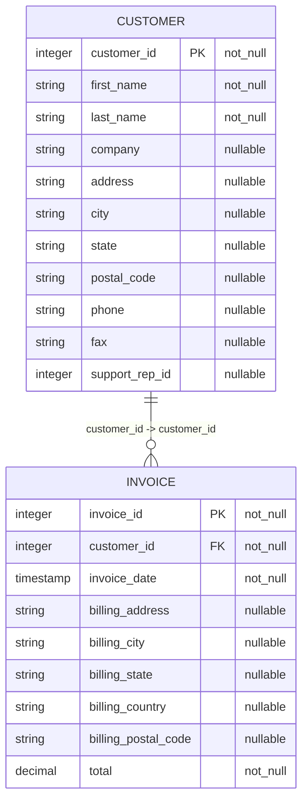

# ER Diagram: existing

```mermaid
erDiagram
    CUSTOMER {
        integer customer_id PK "not_null"
        string first_name "not_null"
        string last_name "not_null"
        string company "nullable"
        string address "nullable"
        string city "nullable"
        string state "nullable"
        string postal_code "nullable"
        string phone "nullable"
        string fax "nullable"
        integer support_rep_id "nullable"
    }
    INVOICE {
        integer invoice_id PK "not_null"
        integer customer_id FK "not_null"
        timestamp invoice_date "not_null"
        string billing_address "nullable"
        string billing_city "nullable"
        string billing_state "nullable"
        string billing_country "nullable"
        string billing_postal_code "nullable"
        decimal total "not_null"
    }

    CUSTOMER ||--o{ INVOICE : "customer_id -> customer_id"

```
