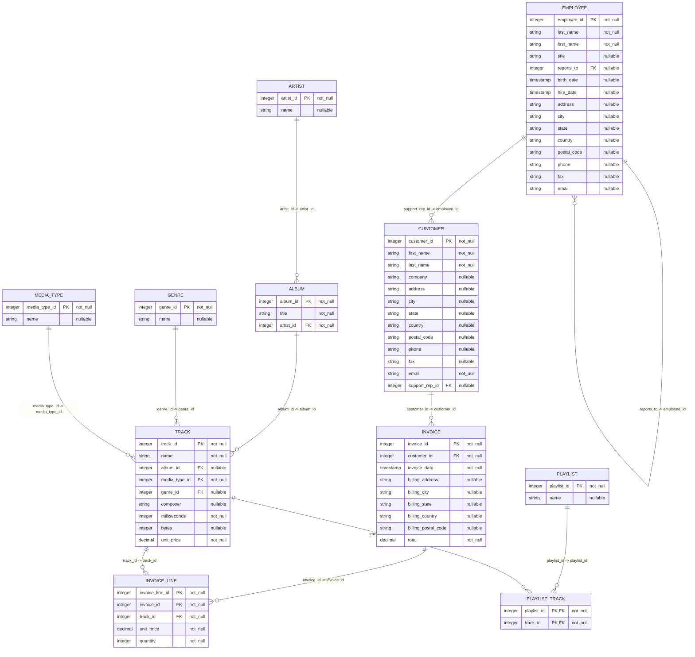

# ER Diagram: parsed

```mermaid
erDiagram
    ALBUM {
        integer album_id PK "not_null"
        string title "not_null"
        integer artist_id FK "not_null"
    }
    ARTIST {
        integer artist_id PK "not_null"
        string name "nullable"
    }
    CUSTOMER {
        integer customer_id PK "not_null"
        string first_name "not_null"
        string last_name "not_null"
        string company "nullable"
        string address "nullable"
        string city "nullable"
        string state "nullable"
        string country "nullable"
        string postal_code "nullable"
        string phone "nullable"
        string fax "nullable"
        string email "not_null"
        integer support_rep_id FK "nullable"
    }
    EMPLOYEE {
        integer employee_id PK "not_null"
        string last_name "not_null"
        string first_name "not_null"
        string title "nullable"
        integer reports_to FK "nullable"
        timestamp birth_date "nullable"
        timestamp hire_date "nullable"
        string address "nullable"
        string city "nullable"
        string state "nullable"
        string country "nullable"
        string postal_code "nullable"
        string phone "nullable"
        string fax "nullable"
        string email "nullable"
    }
    GENRE {
        integer genre_id PK "not_null"
        string name "nullable"
    }
    INVOICE {
        integer invoice_id PK "not_null"
        integer customer_id FK "not_null"
        timestamp invoice_date "not_null"
        string billing_address "nullable"
        string billing_city "nullable"
        string billing_state "nullable"
        string billing_country "nullable"
        string billing_postal_code "nullable"
        decimal total "not_null"
    }
    INVOICE_LINE {
        integer invoice_line_id PK "not_null"
        integer invoice_id FK "not_null"
        integer track_id FK "not_null"
        decimal unit_price "not_null"
        integer quantity "not_null"
    }
    MEDIA_TYPE {
        integer media_type_id PK "not_null"
        string name "nullable"
    }
    PLAYLIST {
        integer playlist_id PK "not_null"
        string name "nullable"
    }
    PLAYLIST_TRACK {
        integer playlist_id PK,FK "not_null"
        integer track_id PK,FK "not_null"
    }
    TRACK {
        integer track_id PK "not_null"
        string name "not_null"
        integer album_id FK "nullable"
        integer media_type_id FK "not_null"
        integer genre_id FK "nullable"
        string composer "nullable"
        integer milliseconds "not_null"
        integer bytes "nullable"
        decimal unit_price "not_null"
    }

    ARTIST ||--o{ ALBUM : "artist_id -> artist_id"
    EMPLOYEE ||--o{ CUSTOMER : "support_rep_id -> employee_id"
    EMPLOYEE ||--o{ EMPLOYEE : "reports_to -> employee_id"
    CUSTOMER ||--o{ INVOICE : "customer_id -> customer_id"
    INVOICE ||--o{ INVOICE_LINE : "invoice_id -> invoice_id"
    TRACK ||--o{ INVOICE_LINE : "track_id -> track_id"
    PLAYLIST ||--o{ PLAYLIST_TRACK : "playlist_id -> playlist_id"
    TRACK ||--o{ PLAYLIST_TRACK : "track_id -> track_id"
    ALBUM ||--o{ TRACK : "album_id -> album_id"
    GENRE ||--o{ TRACK : "genre_id -> genre_id"
    MEDIA_TYPE ||--o{ TRACK : "media_type_id -> media_type_id"

```
