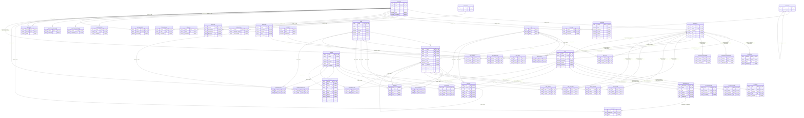

# ER Diagram: parsed

```mermaid
erDiagram
    COUNTRY {
        string name "not_null"
        string code PK,FK "not_null"
        string capital FK "nullable"
        string province FK "nullable"
        decimal area "nullable"
        decimal population "nullable"
    }
    CITY {
        string name PK "not_null"
        string country PK,FK "not_null"
        string province PK,FK "not_null"
        decimal population "nullable"
        decimal latitude "nullable"
        decimal longitude "nullable"
        decimal elevation "nullable"
    }
    PROVINCE {
        string name PK "not_null"
        string country PK,FK "not_null"
        decimal population "nullable"
        decimal area "nullable"
        string capital FK "nullable"
        string capprov FK "nullable"
    }
    ECONOMY {
        string country PK,FK "not_null"
        decimal gdp "nullable"
        decimal agriculture "nullable"
        decimal service "nullable"
        decimal industry "nullable"
        decimal inflation "nullable"
        decimal unemployment "nullable"
    }
    POPULATION {
        string country PK,FK "not_null"
        decimal population_growth "nullable"
        decimal infant_mortality "nullable"
    }
    POLITICS {
        string country PK,FK "not_null"
        date independence "nullable"
        string wasdependent "nullable"
        string dependent FK "nullable"
        string government "nullable"
    }
    RELIGION {
        string country PK,FK "not_null"
        string name PK "not_null"
        decimal percentage "nullable"
    }
    ETHNICGROUP {
        string country PK,FK "not_null"
        string name PK "not_null"
        decimal percentage "nullable"
    }
    SPOKEN {
        string country PK,FK "not_null"
        string language PK,FK "not_null"
        decimal percentage "nullable"
    }
    LANGUAGE {
        string name PK "not_null"
        string superlanguage FK "nullable"
    }
    COUNTRYPOPS {
        string country PK,FK "not_null"
        decimal year PK "not_null"
        decimal population "nullable"
    }
    COUNTRYOTHERNAME {
        string country PK,FK "not_null"
        string othername PK "not_null"
    }
    COUNTRYLOCALNAME {
        string country PK,FK "not_null"
        string localname "nullable"
    }
    PROVPOPS {
        string province PK,FK "not_null"
        string country PK,FK "not_null"
        decimal year PK "not_null"
        decimal population "nullable"
    }
    PROVINCEOTHERNAME {
        string province PK,FK "not_null"
        string country PK,FK "not_null"
        string othername PK "not_null"
    }
    PROVINCELOCALNAME {
        string province PK,FK "not_null"
        string country PK,FK "not_null"
        string localname "nullable"
    }
    CITYPOPS {
        string city PK,FK "not_null"
        string country PK,FK "not_null"
        string province PK,FK "not_null"
        decimal year PK "not_null"
        decimal population "nullable"
    }
    CITYOTHERNAME {
        string city PK,FK "not_null"
        string country PK,FK "not_null"
        string province PK,FK "not_null"
        string othername PK "not_null"
    }
    CITYLOCALNAME {
        string city PK,FK "not_null"
        string country PK,FK "not_null"
        string province PK,FK "not_null"
        string localname "nullable"
    }
    CONTINENT {
        string name PK "not_null"
        decimal_10_ area "nullable"
    }
    BORDERS {
        string country1 PK,FK "not_null"
        string country2 PK,FK "not_null"
        decimal length "nullable"
    }
    ENCOMPASSES {
        string country PK,FK "not_null"
        string continent PK,FK "not_null"
        decimal percentage "nullable"
    }
    ORGANIZATION {
        string abbreviation PK "not_null"
        string name "not_null"
        string city FK "nullable"
        string country FK "nullable"
        string province FK "nullable"
        date established "nullable"
    }
    ISMEMBER {
        string country PK,FK "not_null"
        string organization PK,FK "not_null"
        string type "nullable"
    }
    MOUNTAIN {
        string name PK "not_null"
        string mountains "nullable"
        decimal elevation "nullable"
        string type "nullable"
        geocoord coordinates "nullable"
    }
    DESERT {
        string name PK "not_null"
        decimal area "nullable"
        geocoord coordinates "nullable"
    }
    ISLAND {
        string name PK "not_null"
        string islands "nullable"
        decimal area "nullable"
        decimal elevation "nullable"
        string type "nullable"
        geocoord coordinates "nullable"
    }
    LAKE {
        string name PK "not_null"
        string river FK "nullable"
        decimal area "nullable"
        decimal elevation "nullable"
        decimal depth "nullable"
        decimal height "nullable"
        string type "nullable"
        geocoord coordinates "nullable"
    }
    SEA {
        string name PK "not_null"
        decimal area "nullable"
        decimal depth "nullable"
    }
    RIVER {
        string name PK "not_null"
        string river FK "nullable"
        string lake FK "nullable"
        string sea FK "nullable"
        decimal length "nullable"
        decimal area "nullable"
        geocoord source "nullable"
        string mountains "nullable"
        decimal sourceelevation "nullable"
        geocoord estuary "nullable"
        decimal estuaryelevation "nullable"
    }
    RIVERTHROUGH {
        string river PK,FK "not_null"
        string lake PK,FK "not_null"
    }
    GEO_MOUNTAIN {
        string mountain PK,FK "not_null"
        string country PK,FK "not_null"
        string province PK,FK "not_null"
    }
    GEO_DESERT {
        string desert PK,FK "not_null"
        string country PK,FK "not_null"
        string province PK,FK "not_null"
    }
    GEO_ISLAND {
        string island PK,FK "not_null"
        string country PK,FK "not_null"
        string province PK,FK "not_null"
    }
    GEO_RIVER {
        string river PK,FK "not_null"
        string country PK,FK "not_null"
        string province PK,FK "not_null"
    }
    GEO_SEA {
        string sea PK,FK "not_null"
        string country PK,FK "not_null"
        string province PK,FK "not_null"
    }
    GEO_LAKE {
        string lake PK,FK "not_null"
        string country PK,FK "not_null"
        string province PK,FK "not_null"
    }
    GEO_SOURCE {
        string river PK,FK "not_null"
        string country PK,FK "not_null"
        string province PK,FK "not_null"
    }
    GEO_ESTUARY {
        string river PK,FK "not_null"
        string country PK,FK "not_null"
        string province PK,FK "not_null"
    }
    MERGESWITH {
        string sea1 PK,FK "not_null"
        string sea2 PK,FK "not_null"
    }
    LOCATED {
        string city FK "nullable"
        string province FK "nullable"
        string country FK "nullable"
        string river FK "nullable"
        string lake FK "nullable"
        string sea FK "nullable"
    }
    LOCATEDON {
        string city PK,FK "not_null"
        string province PK,FK "not_null"
        string country PK,FK "not_null"
        string island PK,FK "not_null"
    }
    ISLANDIN {
        string island FK "nullable"
        string sea FK "nullable"
        string lake FK "nullable"
        string river FK "nullable"
    }
    MOUNTAINONISLAND {
        string mountain PK,FK "not_null"
        string island PK,FK "not_null"
    }
    LAKEONISLAND {
        string lake PK,FK "not_null"
        string island PK,FK "not_null"
    }
    RIVERONISLAND {
        string river PK,FK "not_null"
        string island PK,FK "not_null"
    }
    AIRPORT {
        string iatacode PK "not_null"
        string name "nullable"
        string country FK "nullable"
        string city FK "nullable"
        string province FK "nullable"
        string island FK "nullable"
        decimal latitude "nullable"
        decimal longitude "nullable"
        decimal elevation "nullable"
        decimal gmtoffset "nullable"
    }

    CITY ||--o{ COUNTRY : "capital,code,province -> name,country,province"
    PROVINCE ||--o{ CITY : "province,country -> name,country"
    COUNTRY ||--o{ PROVINCE : "country -> code"
    CITY ||--o{ PROVINCE : "capital,country,capprov -> name,country,province"
    COUNTRY ||--o{ ECONOMY : "country -> code"
    COUNTRY ||--o{ POPULATION : "country -> code"
    COUNTRY ||--o{ POLITICS : "country -> code"
    COUNTRY ||--o{ POLITICS : "dependent -> code"
    COUNTRY ||--o{ RELIGION : "country -> code"
    COUNTRY ||--o{ ETHNICGROUP : "country -> code"
    COUNTRY ||--o{ SPOKEN : "country -> code"
    LANGUAGE ||--o{ SPOKEN : "language -> name"
    LANGUAGE ||--o{ LANGUAGE : "superlanguage -> name"
    COUNTRY ||--o{ COUNTRYPOPS : "country -> code"
    COUNTRY ||--o{ COUNTRYOTHERNAME : "country -> code"
    COUNTRY ||--o{ COUNTRYLOCALNAME : "country -> code"
    PROVINCE ||--o{ PROVPOPS : "province,country -> name,country"
    PROVINCE ||--o{ PROVINCEOTHERNAME : "province,country -> name,country"
    PROVINCE ||--o{ PROVINCELOCALNAME : "province,country -> name,country"
    CITY ||--o{ CITYPOPS : "city,country,province -> name,country,province"
    CITY ||--o{ CITYOTHERNAME : "city,country,province -> name,country,province"
    CITY ||--o{ CITYLOCALNAME : "city,country,province -> name,country,province"
    COUNTRY ||--o{ BORDERS : "country1 -> code"
    COUNTRY ||--o{ BORDERS : "country2 -> code"
    COUNTRY ||--o{ ENCOMPASSES : "country -> code"
    CONTINENT ||--o{ ENCOMPASSES : "continent -> name"
    CITY ||--o{ ORGANIZATION : "city,country,province -> name,country,province"
    COUNTRY ||--o{ ISMEMBER : "country -> code"
    ORGANIZATION ||--o{ ISMEMBER : "organization -> abbreviation"
    RIVER ||--o{ RIVER : "river -> name"
    LAKE ||--o{ RIVER : "lake -> name"
    SEA ||--o{ RIVER : "sea -> name"
    RIVER ||--o{ LAKE : "river -> name"
    RIVER ||--o{ RIVERTHROUGH : "river -> name"
    LAKE ||--o{ RIVERTHROUGH : "lake -> name"
    SEA ||--o{ MERGESWITH : "sea1 -> name"
    SEA ||--o{ MERGESWITH : "sea2 -> name"
    MOUNTAIN ||--o{ GEO_MOUNTAIN : "mountain -> name"
    PROVINCE ||--o{ GEO_MOUNTAIN : "province,country -> name,country"
    DESERT ||--o{ GEO_DESERT : "desert -> name"
    PROVINCE ||--o{ GEO_DESERT : "province,country -> name,country"
    ISLAND ||--o{ GEO_ISLAND : "island -> name"
    PROVINCE ||--o{ GEO_ISLAND : "province,country -> name,country"
    RIVER ||--o{ GEO_RIVER : "river -> name"
    PROVINCE ||--o{ GEO_RIVER : "province,country -> name,country"
    SEA ||--o{ GEO_SEA : "sea -> name"
    PROVINCE ||--o{ GEO_SEA : "province,country -> name,country"
    LAKE ||--o{ GEO_LAKE : "lake -> name"
    PROVINCE ||--o{ GEO_LAKE : "province,country -> name,country"
    RIVER ||--o{ GEO_SOURCE : "river -> name"
    PROVINCE ||--o{ GEO_SOURCE : "province,country -> name,country"
    RIVER ||--o{ GEO_ESTUARY : "river -> name"
    PROVINCE ||--o{ GEO_ESTUARY : "province,country -> name,country"
    CITY ||--o{ LOCATED : "city,country,province -> name,country,province"
    RIVER ||--o{ LOCATED : "river -> name"
    LAKE ||--o{ LOCATED : "lake -> name"
    SEA ||--o{ LOCATED : "sea -> name"
    CITY ||--o{ LOCATEDON : "city,country,province -> name,country,province"
    ISLAND ||--o{ LOCATEDON : "island -> name"
    ISLAND ||--o{ ISLANDIN : "island -> name"
    SEA ||--o{ ISLANDIN : "sea -> name"
    LAKE ||--o{ ISLANDIN : "lake -> name"
    RIVER ||--o{ ISLANDIN : "river -> name"
    MOUNTAIN ||--o{ MOUNTAINONISLAND : "mountain -> name"
    ISLAND ||--o{ MOUNTAINONISLAND : "island -> name"
    LAKE ||--o{ LAKEONISLAND : "lake -> name"
    ISLAND ||--o{ LAKEONISLAND : "island -> name"
    RIVER ||--o{ RIVERONISLAND : "river -> name"
    ISLAND ||--o{ RIVERONISLAND : "island -> name"
    COUNTRY ||--o{ AIRPORT : "country -> code"
    CITY ||--o{ AIRPORT : "city,country,province -> name,country,province"
    ISLAND ||--o{ AIRPORT : "island -> name"

```
